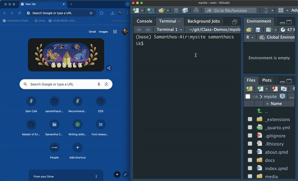
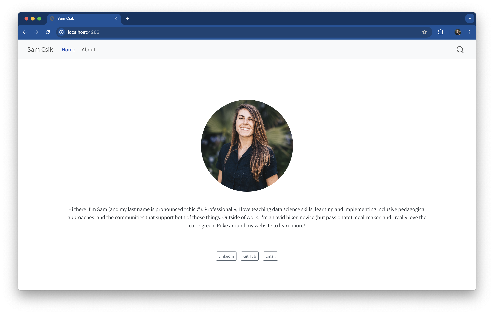
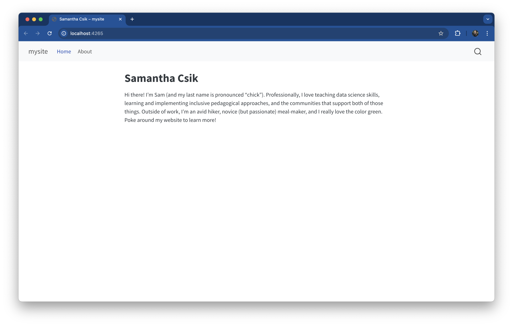
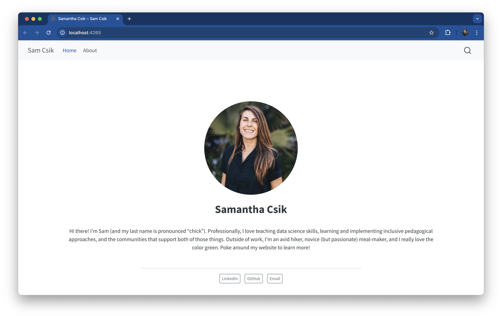
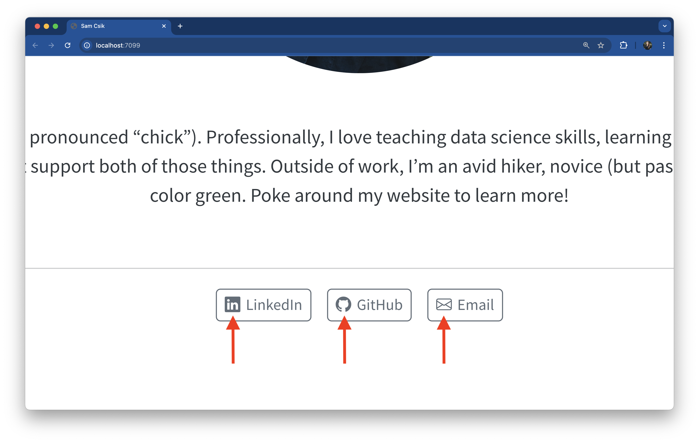
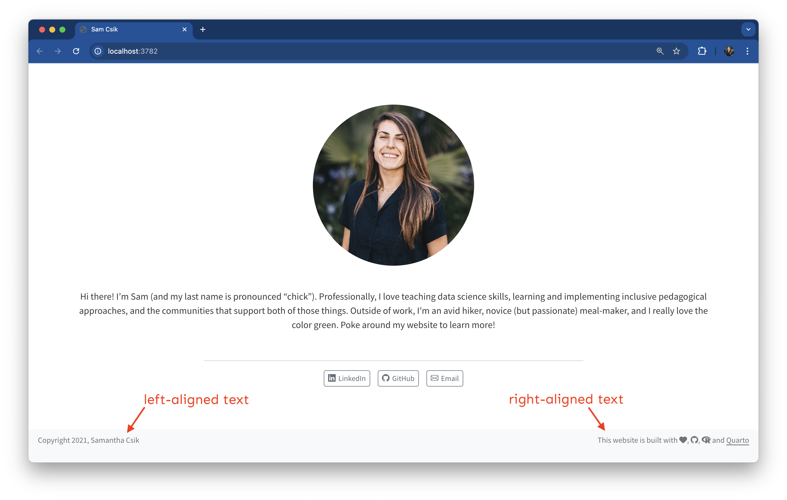
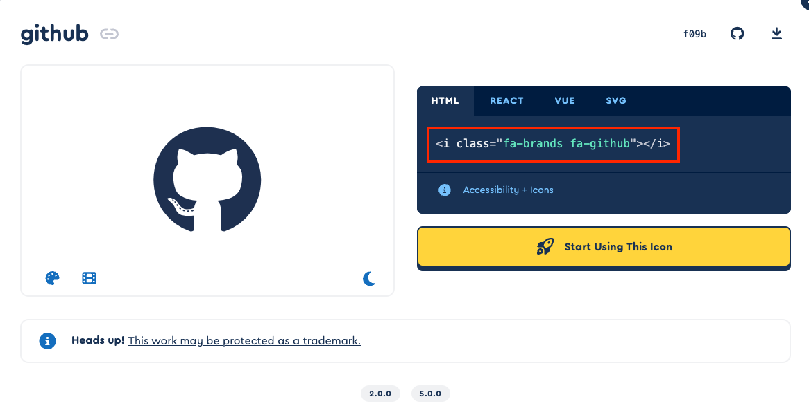
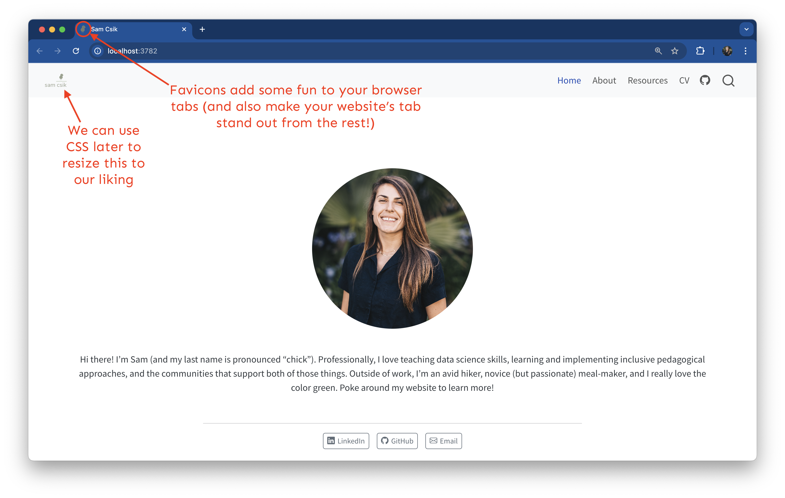

```{r setup, include = FALSE}
# libraries --------------------------------------------------------------------
library(anicon)
library(countdown)
library(fontawesome)
library(knitr)

# functions --------------------------------------------------------------------
include_img <- function(img_name) {
  paste0("https://raw.githubusercontent.com/damien-dupre/img/main/", img_name) |> 
  knitr::include_graphics()
}
```

## For Today

#### Requirements:

- ✅ Having Git Installed and its Config done
- ✅ Having VS Code Installed with all required Extensions installed
- ✅ Having Quarto Installed and Properly Working
- ✅ GitHub Account Created

#### Programme

1. Creating your Quarto Website
2. Push it to GitHub 
3. Activating GitHub Pages

### Any questions?

# Create a website with Markdown

## Quarto Websites

Quarto Websites are a convenient way to publish groups of documents. Documents published as part of a website share navigational elements, rendering options, and visual style.

:::: {layout="[1,1]"}
::: {#first-column}
Website navigation can be provided through a global navbar, a sidebar with links, or a combination of both for sites that have multiple levels of content. You can also enable full text search for websites.
:::

::: {#second-column}
```{r}
include_graphics("https://www.paulbarrs.com/wp-content/uploads/2017/09/painful.jpg")
```
:::
::::

## Your Turn: Quarto Website {background="#43464B"}

1. Open VS Code, open a new Terminal window in VS Code and run the following instructions to create a new Quarto website by using your GitHub username + .github.io (e.g. damien-dupre.github.io):

```{.bash filename="Terminal"}
quarto create project website your-github-username.github.io
```

When asked for the name of your website, use your name (e.g. Damien Dupré), and then:

```{.bash filename="Terminal"}
quarto preview
```

```{r}
countdown(minutes = 3, warn_when = 60)
```

## Quarto Websites

```{.bash filename="Terminal"}
quarto create project website your-github-username.github.io
```

This creates a new website project from the Terminal. This website project is initiated by a folder called `your-github-username.github.io` located on the root of your terminal.

The folder contains only 4 files:

- `_quarto.yml` is a yaml file, it design the overall style and the navbar
- `index.qmd` is a quarto file, it corresponds to the homepage
- `about.qmd` is another quarto file which is displayed when about is clicked on the navbar
- `styles.css` is for additional style not defined in `_quarto.yml`

## Quarto Websites

Improve your Website:

- Navigation instructions here: [https://quarto.org/docs/websites/website-navigation.html](https://quarto.org/docs/websites/website-navigation.html)
- Option instructions here: [https://quarto.org/docs/reference/projects/websites.html](https://quarto.org/docs/reference/projects/websites.html)

## Quarto Websites

```{.bash filename="Terminal"}
quarto preview
```

This command is used to render the website by converting all the `.qmd` files to `.html` files stored in a `_site` folder. 

The website preview will open in a new web browser. As you edit and save `index.qmd` (or other files like `about.qmd`) the preview is automatically updated.

```{r}
include_graphics("https://ucsb-meds.github.io/creating-quarto-websites/media/rendered_site.png")
```

<!-- ## .qmd Files -->

<!-- Unfortunately `.ipynb` files cannot be used to build a website.  -->

<!-- Thankfully they can be converted to `.qmd` format by quarto with the instruction:  -->

<!-- ```{.bash filename="Terminal"} -->
<!-- quarto convert myfile.ipynb -->
<!-- ``` -->

<!-- `.qmd` files are actually very similar to `.ipynb` files and are tailored for quarto: -->

<!-- - They have a yaml displayed between two series of `---` signs -->
<!-- - They have markdown text -->
<!-- - They can have code cell, also called chunks -->

<!-- ## .qmd Files -->

<!-- Chunks are delimited by 3 backticks on each end ` ``` ` followed by the engine (`python`) between curly braces `{python}`  -->

<!-- ````markdown -->
<!-- ```{{python}} -->
<!-- print('Hello, world!') -->
<!-- ``` -->
<!-- ```` -->

<!-- ## Exercise 2: Convert a Notebook to .qmd {background="#43464B"} -->

<!-- :::: {layout="[1,1]"} -->
<!-- ::: {} -->
<!-- 1. Open a new Terminal window in VS Code and run the following instructions: -->

<!-- ```{.bash filename="Terminal"} -->
<!-- quarto convert hello.ipynb -->
<!-- ``` -->

<!-- 2. Drag and drop the file `hello.qmd` created in the root of the `your-github-username.github.io` folder\ -->

<!-- ::: -->
<!-- ::: {} -->
<!-- 3. Open the file `_quarto.yml` in Jupyter and modify it as follow: -->

<!-- ```{.yml filename="_quarto.yml"} -->
<!-- website: -->
<!--   title: "Damien Dupré" -->
<!--   navbar: -->
<!--     left: -->
<!--       - href: index.qmd -->
<!--         text: Home -->
<!--       - about.qmd -->
<!--       - hello.qmd -->
<!-- ``` -->

<!-- 4. In the same Terminal window, run the following instructions: -->

<!-- ```{.bash filename="Terminal"} -->
<!-- quarto preview -->
<!-- ``` -->

<!-- ::: -->
<!-- :::: -->


<!-- ```{r} -->
<!-- countdown(minutes = 10, warn_when = 60) -->
<!-- ``` -->

# Publish this website on GitHub

## Overview

There are three ways to publish Quarto websites and documents to GitHub Pages:

- **Render sites on your local machine to the docs directory**, check the rendered site into GitHub, and then configure your GitHub repo to publish from the docs directory.

- **Use the quarto publish command** to publish content rendered on your local machine.

- **Use a GitHub Action** to automatically render your files (a single Quarto document or a Quarto project) and publish the resulting content whenever you push a source code change to your repository.

#### The simplest way to publish using GitHub Pages is to render to the docs directory and then upload that directory into your repository...

## Overview

#### ... but it won't be as easy as it looks I'm afraid!

```{r out.width='90%'}
include_graphics("http://techrights.org/wp-content/uploads/2021/10/github-dark-side.jpg")
```

## Render the Website docs Folder

In the `_quarto.yml` file, simply **change the output directory folder** to a folder named `docs` as follow:

```{.yml filename="_quarto.yml"}
project:
  type: website
  output-dir: docs
```

Then, render the website:

```{.bash filename="Terminal"}
quarto render
```

## Add a .nojekyll File

Add a `.nojekyll` file to the root of your repository that tells GitHub Pages not to use Jekyll (the GitHub default site generation tool).

::: {.callout-important}
## Important

Jekyll ignores files and folders that start with an underscore. Many modern static site tools like Quarto, Hugo, or plain build pipelines generate folders such as _site or _resources. When Jekyll runs, those folders can be silently dropped, which breaks the site.
:::

<!-- You can create an empty text file by yourself or you can download this `nojekyll` file here: -->
```{r}
# downloadthis::download_file(
#   path = here::here("nojekyll"),
#   output_name = "nojekyll",
#   button_label = "Click here to download nojekyll",
#   has_icon = TRUE,
#   icon = "fa fa-save",
#   self_contained = FALSE
# )
```

You can create it from the terminal when the website folder is the current directory:

:::: {layout="[1,1,1]"}
::: {#first-column}
```{.bash filename="Bash or zsh"}
touch .nojekyll
```
:::

::: {#second-column}
```{.bash filename="CMD"}
type nul > .nojekyll
```
:::

::: {#third-column}
```{.bash filename="PowerShell"}
ni .nojekyll
```
:::
::::

## Render the Website docs Folder

Your website default folder should look like that

```{r out.width='80%'}
include_img("mysite_docs.png")
```

Note: the old folder `_site` will not be used any more and is now useless.

<!-- ## Upload your Files to GitHub -->

<!-- When GitHub suggests ways how to upload files, it gives instructions to **create a new repository on the command line** with git. -->

<!-- For example: -->

<!-- ```{.bash filename="Terminal"} -->
<!-- cd your-github-username.github.io #if not done yet -->
<!-- git init -->
<!-- git add . -->
<!-- git commit -m "first commit" -->
<!-- git branch -M main -->
<!-- git remote add origin https://github.com/your-github-username/your-github-username.github.io.git -->
<!-- git push -u origin main -->
<!-- ``` -->

<!-- You should see all your files uploaded in your GitHub repository -->

## Your Turn: Your Quarto Website in GitHub  {background="#43464B"}

:::: {layout="[1,1]"}
::: {#first-column}
1. Add a .nojekyll File:

```{.bash filename="Terminal"}
touch .nojekyll # Bash or zsh
type nul > .nojekyll # CMD
ni .nojekyll #PowerShell
```

2. **Change the output directory folder** to a folder named `docs` in the `_quarto.yml` file:

```{.yml filename="_quarto.yml"}
project:
  type: website
  output-dir: docs
```

Then, render the website

```{.bash filename="Terminal"}
quarto render
```
:::
::: {#second-column}
3. In the `Source Control` panel, click <kbd>Initialize Repository</kbd>, add all files by clicking on <kbd>+</kbd>, add a mandatory message and click <kbd>✔️ Commit</kbd>. Finally, click <kbd>Publish Branch</kbd>

4. In **GitHub**, click **Settings** -> **Pages** choose:

  - `main` branch
  - `/docs` folder
  - and Save

:::
::::

```{r}
countdown(minutes = 10, warn_when = 60)
```

## Existing Quarto Websites

```{=html}
<iframe width="1000" height="500" src="https://damien-dupre.github.io/"></iframe>
```

- [`r fa(name = "globe")` https://damien-dupre.github.io/](https://damien-dupre.github.io/)
- [`r fa(name = "github")` https://github.com/damien-dupre/damien-dupre.github.io](https://github.com/damien-dupre/damien-dupre.github.io)

## Existing Quarto Websites

```{=html}
<iframe width="1000" height="500" src="https://samanthacsik.github.io/"></iframe>
```

- [`r fa(name = "globe")` https://samanthacsik.github.io/](https://samanthacsik.github.io/)
- [`r fa(name = "github")` https://github.com/samanthacsik/samanthacsik.github.io](https://github.com/samanthacsik/samanthacsik.github.io)

## Existing Quarto Websites

```{=html}
<iframe width="1000" height="500" src="https://robertmitchellv.com/"></iframe>
```

- [`r fa(name = "globe")` https://robertmitchellv.com/](https://robertmitchellv.com/)
- [`r fa(name = "github")` https://github.com/robertmitchellv/robertmitchellv.github.io](https://github.com/robertmitchellv/robertmitchellv.github.io)

## Existing Quarto Websites

```{=html}
<iframe width="1000" height="500" src="https://www.garrickadenbuie.com/"></iframe>
```

- [`r fa(name = "globe")` https://www.garrickadenbuie.com/](https://www.garrickadenbuie.com/)
- [`r fa(name = "github")` https://github.com/gadenbuie/garrickadenbuie-com](https://github.com/gadenbuie/garrickadenbuie-com)

## Existing Quarto Websites

```{=html}
<iframe width="1000" height="500" src="https://www.cwick.co.nz/"></iframe>
```

- [`r fa(name = "globe")` https://www.cwick.co.nz/](https://www.cwick.co.nz/)
- [`r fa(name = "github")` https://github.com/cwickham/cwick.co.nz](https://github.com/cwickham/cwick.co.nz)

<!-- ## Requirement -->

<!-- You should already have a Quarto website (or at least the bones of one) that: -->

<!-- - is deployed using GitHub Pages and -->
<!-- - contains some content (e.g. text, headings, etc.) for us to customize -->

<!-- Beside these slides, have a look at the GitHub Repository ["Awesome Quarto"](https://github.com/mcanouil/awesome-quarto) for more support and examples. -->

<!-- ::: {.footer} -->
<!-- **If you first need to get your website up and running, follow along with these [step-by-step instructions](https://damien-dupre.github.io/BAA1028/lectures/lecture_6#/title-slide) before moving forward.** -->
<!-- ::: -->

## Quarto Website Default Design {.smaller}

When we **render** a new Quarto site, it **converts** all of our **markdown into HTML** and **applies a pre-built CSS stylesheet** (the Bootswatch [Cosmo theme](https://bootswatch.com/cosmo/)). 

[We can modify the appearance of our website in a number of ways:]{.body-text-m .teal-text}

::: {.incremental}
::: {.body-text-s}
- [**Editing the `index.qmd` YAML**]{.teal-text} -- you can apply a [pre-built template](https://quarto.org/docs/websites/website-about.html#templates) to give your landing page a sleek and professional appearance (we can further modify this later with some CSS).

- [**Editing the `_quarto.yml` file**]{.teal-text} -- this is our website configuration file,  where we can easily update our website's navigation (e.g. add new pages), add a page footer, a [favicon](https://en.wikipedia.org/wiki/Favicon), and much more. We can also switch the default theme to a different pre-built [Bootswatch theme](https://bootswatch.com/) (by replacing `cosmo` with an alternative theme name).

- [**Defining CSS rules in the `styles.css` file**]{.teal-text} that comes with every new Quarto site. This allows you to fine-tune the appearance of your site.

- [**Creating a `.scss` file(s)**]{.teal-text} that contains [Sass](https://sass-lang.com/) variables to quickly customize your website's theme -- these take the form of `$var-name: value;` and you can find a list of them in the [Quarto documentation](https://quarto.org/docs/output-formats/html-themes.html#sass-variables).

- Or...

:::
:::

## Quarto Website Default Design

Combine all of the above!

Approaching this in the following order worked best for me:

::: incremental
- [**First**]{.teal-text}, add a [pre-built template](https://quarto.org/docs/websites/website-about.html#templates) to `index.qmd` and adjust website configurations by editing `_quarto.yml` -- this is the easiest way to add some really cool features with minimal effort.

- [**Next**]{.teal-text}, create a `styles.scss` file, link to it in `_quarto.yml` (this applies your styles to your Quarto site), and define your Sass variables.

- [**Finally**]{.teal-text}, make fine-tuned adjustments by defining CSS rules directly in your `styles.scss` file (you can write CSS in `.scss` files, but not Sass in `.css` files).
:::

<!-- ## Quarto Website Default Design -->

<!-- Working on branches is recommended! -->

<!-- > I almost always work on a branch when making changes to my website -- this way I can safely test changes before deploying them to my live site. -->

<!-- To create a branch, first ensure that you're on `main` by typing either `git branch` or `git status` into the RStudio Terminal (either will tell you which branch you're currently on). If you're not on `main`, you can switch by running `git checkout main`. -->

<!-- ## Quarto Website Default Design -->

<!-- Create a local git branch from `main` by running the following in your Terminal: -->

<!-- ```{bash filename="Terminal"} -->
<!-- #| eval: false -->
<!-- #| echo: true -->
<!-- #| code-line-numbers: false -->
<!-- git checkout -b my-new-branch -->
<!-- ``` -->

<!-- Push your new local branch to GitHub by running the following in your Terminal: -->

<!-- ```{bash filename="Terminal"} -->
<!-- #| eval: false -->
<!-- #| echo: true -->
<!-- #| code-line-numbers: false -->
<!-- git push -u origin my-new-branch -->
<!-- ``` -->

<!-- You're now ready to work as normal! Once satisfied with your changes, you can `git add`, `git commit -m "my commit message"`, and `git push` (or use the RStudio GUI buttons in the **Git** tab) your files. Open a [pull request](https://docs.github.com/en/pull-requests/collaborating-with-pull-requests/proposing-changes-to-your-work-with-pull-requests/about-pull-requests) from GitHub and [merge](https://docs.github.com/en/pull-requests/collaborating-with-pull-requests/incorporating-changes-from-a-pull-request/merging-a-pull-request) into `main` to integrate your changes. -->

## Preview your site for fast iteration

Run `quarto preview` in the VS Code Terminal to view changes in near real time – each time you edit and save your work, the preview will update in your browser.

```{r}

```

Note: this is RStudio but it would be the same with VS Code

# Quarto Pre-Built Templates

## So you've created a Quarto website...

[Quarto](https://quarto.org/) gives us an easy-to-use web publishing format to create our personal websites, that we can develop in a space that is comfortable (VS Code) and write mostly Markdown syntax (which is rendered as HTML when we build our website). 

:::: {layout="[1,1]"}
::: {#first-column}
```{r}

```
:::

::: {#second-column}
A massive benefit is that these websites already look pretty slick right out of the box.

This page is an example Quarto website styled using the built-in Bootswatch theme [Cosmo](https://bootswatch.com/cosmo/) and the `jolla` [layout template](https://quarto.org/docs/websites/website-about.html) applied.
:::
::::

##  Edit YAML

Adding a [pre-built template](https://quarto.org/docs/websites/website-about.html#templates) to `index.qmd` and adjusting website configurations by editing `_quarto.yml` is the easiest way to add some really cool features with minimal effort.

You can apply a template to any of your website's pages, though they are particularly awesome for creating a clean, professional-looking landing page.

##  Edit YAML

Quarto includes 5 built in templates, drawing inspiration from the [Postcards R Package](https://cran.r-project.org/web/packages/postcards/readme/README.html). Built-in templates include:

-   `jolla`
-   `trestles`
-   `solana`
-   `marquee`
-   `broadside`

##  Edit YAML

Each template will position the about elements with the content in a different layout. Select the template using the `template` option:

``` yaml
---
about:
  template: trestles
---
```

##  Edit YAML

Here is a preview of each of the templates:

::: {.panel-tabset style="height: 4in;"}
### jolla

[](https://quarto.org/docs/websites/images/about-jolla.png){.border fig-alt="Screenshot of About page with jolla template. Photo is a centered circle above a heading with the author's name. There is a centered paragraph below the header, a separator line, and then buttons for twitter and github centered at the bottom."}

### trestles

[](https://quarto.org/docs/websites/images/about-trestles.png){.border fig-alt="Screenshot of About page with trestles template. On the left-hand side there is a rectangular photo above the author's name, and two buttons (one for twitter, and one for github below). On the right hand side there is a paragraph of body text followed by headered sections for Education and Experience."}

### solana

[](https://quarto.org/docs/websites/images/about-solana.png){.border fig-alt="Screenshot of About page with solana template. The left-hand side has the name as a main header with buttons for twitter and github below it. Below the buttons there is a paragraph of body text, followed by headered sections for Education and Experience. In the upper right-hand column there is a rectangular image."}

### marquee

[](https://quarto.org/docs/websites/images/about-marquee.png){.border fig-alt="Screenshot of About page with marquee template. A large square image is at the top. Beneath that the author's name is a header, and there is a paragraph of body text, followed by headered sections for Education and Experience. Centered at the bottom of the page are links to Twitter and GitHub with their respective icons next to them."}

### broadside

[](https://quarto.org/docs/websites/images/about-broadside.png){.border fig-alt="Screenshot of About page with broadside template. The left side is a rectangular image. On the right-hand side the author's name is a header, and there is a paragraph of body text, followed by headered sections for Education and Experience. Centered at the bottom of the page are links to Twitter and GitHub with their respective icons next to them."}
:::

##  Edit YAML

The image for the about page will be read from the document-level `image` option:

``` yaml
---
title: Finley Malloc
image: profile.jpg
about:
  template: jolla
---
```

## Edit YAML {.smaller}

In addition, you can customize how the image is displayed in the page to better meet your needs by setting the following options.

| option        | description                                                                           | templates                     |
|------------------|----------------------------------|--------------------|
| `image-width` | A valid CSS width for your image.                                                     | all                           |
| `image-shape` | The shape of the image on the about page. Choose from:`rectangle`, `round`, `rounded` | `jolla`, `solana`, `trestles` |
| `image-alt`   | Alternative text for image                                                            | all                           |
| `image-title` | Title for image                                                                       | all                           |

For example:

``` yaml
---
title: Finley Malloc
image: profile.png
about:
  template: trestles
  image-width: 10em
  image-shape: round
---
```

## Edit YAML {.smaller}

Your about page also may contain a set of links to other resources about you or your organization. 

Each template will render these links in a slightly different way. Here are the options that you can specify for each link:

| Option       | Description                                                                                                                        |
|-------------------|-----------------------------------------------------|
| `href`       | Link to file contained with the project or an external URL.                                                                        |
| `text`       | Text to display for navigation item (defaults to the document `title` if not provided).                                            |
| `icon`       | Name of one of the standard [Bootstrap 5 icons](https://icons.getbootstrap.com/) (e.g. "github", "twitter", "share", etc.).        |
| `aria-label` | [Accessible label](https://developer.mozilla.org/en-US/docs/Web/Accessibility/ARIA/Attributes/aria-label) for the navigation item. |

## Add a landing page template

Here is an example:

:::: {.columns}
::: {.column width="47%"}
```{r}
#| out-width: "90%" 

```

Without an About Page template

:::

::: {.column width="47%"}
```{r}
#| out-width: "92%" 

```

`jolla` About Page template

:::
::::

## Add a landing page template

And the corresponding code

```{.yaml}
---
# title: "Samantha Csik" # optional (omitted in example screenshots)
image: file/path/to/headshot.jpeg # a great spot for your professional headshot :) 
toc: false # disable table of contents for this page (if applicable)
about: 
  template: jolla 
  image-shape: round
  image-width: 17em
  links: # create buttons
    - text: LinkedIn
      href: https://www.linkedin.com/in/samanthacsik/
      target: _blank # opens link in a new browser tab
    - text: GitHub
      href: https://github.com/samanthacsik
      target: _blank 
    - text: Email
      href: mailto:scsik@ucsb.edu
---
        
# ~ landing page content / text omitted for brevity ~        
```

## FontAwesome Icons

Add any free [FontAwesome icons](https://fontawesome.com/search?o=r&m=free) to your buttons using the `icon` option. For example:

:::: {layout="[1,1]"}
::: {#first-column}
```{r}

```
:::

::: {#second-column}
```{.yaml code-line-numbers=false}
---
# ~ additional YAML excluded for brevity ~
  links: 
    - icon: linkedin 
      text: LinkedIn
      href: https://www.linkedin.com/in/yourlinkedinname/
      target: _blank
---
```
:::
::::

Be sure to spell the icon name exactly as it appears on FontAwesome's website (e.g. the [LinkedIn icon](https://fontawesome.com/icons/linkedin?f=brands&s=solid), , is all lowercase and spelled, `linkedin`).

## Your Turn: Quarto Template {background="#43464B"}

Use one of the templates (i.e., `jolla`, `trestles`, `solana`, `marquee`, or `broadside`) in a page of your website (i.e., `index.qmd`, `about.qmd`, or any other page).

Remember, you need to change the yaml of your page as follow:

``` yaml
---
image: relative/path/to/your/image.jpg
about:
  template: jolla
  links: # create buttons
    - icon: linkedin 
      text: LinkedIn
      href: https://www.linkedin.com/in/yourname/
---
```

```{r}
countdown(minutes = 10, warn_when = 60)
```

# Customise `_quarto.yml`

## Add / arrange pages

We can configure website navigation in `_quarto.yml`, including the type of navigation menu (`navbar`, `sidebar`), how pages are ordered, etc.

```{r}

```

Here, the navbar items have been moved to the right side, link to a curriculum vitae (pdf), and also add a GitHub icon which links to a GitHub profile.

## Add / arrange pages {.smaller}

Make edits to a website's navigation bar under the `website` > `navbar` option:

```{.yaml filename="_quarto.yml"}
project:
  type: website
  output-dir: docs

website:
  title: "Sam Csik"
  navbar:
    right: # accepts right/left/center; you can also place items individually on the left, right, and center
      - href: index.qmd
        text: Home
      - about.qmd
      - href: resources.qmd
        text: Resources
      - href: file/path/to/myCV.pdf # provide a relative file path to a pdf will open up a browser-based pdf viewer when clicked
        text: CV
        target: _blank # opens link (or page) in a new browser tab
      - icon: github # add icons as navbar buttons
        href: https://github.com/samanthacsik
        target: _blank

format:
  html:
    theme: cosmo
    css: styles.css
    toc: true
    page-layout: full
```

## Add page footer

Footers appear on each page (you may have to scroll to the bottom to see it appear). You can include a mix of text, icons, logos, hyperlinks, etc.

```{r}

```

## Add page footer  {.smaller}

Make edits to a website's footer under the `website` > `page-footer` option:

```{.yaml filename="_quarto.yml"}
project:
  type: website
  output-dir: docs

website:
  title: "Sam Csik"
  navbar:
    right:
      - href: index.qmd
        text: Home
      - about.qmd
      - href: resources.qmd
        text: Resources
      - href: cv/myCV.pdf
        text: CV
        target: _blank 
      - icon: github 
        href: https://github.com/yourUserName
        target: _blank
  page-footer:
    background: light #or dark
    left: Copyright 2021, Samantha Csik
    right: This website is built with , [](https://github.com/samanthacsik/samanthacsik.github.io){target=_blank}, [](https://www.r-project.org/about.html){target=_blank} and [Quarto](https://quarto.org/){target=_blank}

format:
  html:
    theme: cosmo
    css: styles.css
    toc: true
    page-layout: full
```

## FontAwesome Extension

If you want to use FontAwesome icons anywhere else on your website (i.e. outside of the `icon` YAML option), you'll need to first install the Quarto [fontawesome extension](https://quarto-ext.github.io/fontawesome/).

Running the following in your Terminal will download and save the extension to a folder named `_extensions` in your repo's root directory.

Make sure you're in your project's root directory and don't forget to push this new folder (and its contents) to GitHub:

```{.bash filename="Terminal" code-line-numbers=false}
quarto add quarto-ext/fontawesome
```

**Note:** You'll need to install this extension for each new project where you'd like to use icons (e.g. if you create a different website).

## FontAwesome Shortcode

To embed an icon, look up the icon’s name on FontAwesome (be sure to only choose from the [Free icons]((https://fontawesome.com/search?o=r&m=free))), then use the fontawesome shortcode:

```{.markdown code-line-numbers=false}
{}
```

For example, the following shortcodes...

```{.markdown code-line-numbers=false}
{}
{}
{}
```

...will render as , , 

## FontAwesome Brands

Some icons fall within the `brands` collection and must be prefixed with `brands` inside the shortcode. For example, the GitHub icon :

```{.markdown code-line-numbers=false}
{}
```

You can identify if an icon falls within the `brands` collection by clicking on its preview (e.g. the [github icon](https://fontawesome.com/icons/github?f=brands&s=solid)) and checking to see if the HTML class is `fa-brands`:

```{r}

```

## Favicons and Logos

You can add a personal logo in the top left corner of your navbar in place of your title. The free [Adobe Express Logo Maker](https://www.adobe.com/express/create/logo) is a great tool for creating your own logo!

```{=html}
<iframe width="560" height="315" src="https://www.youtube.com/embed/IOTuG21S4k0" allowfullscreen></iframe>
```

**Tip:** Download your logo with a transparent background so that it can be placed anywhere on your site without having to deal with mismatched background colours. I also recommend making them as large as possible before downloading to mitigate the need for drastic resizing using CSS.

## Favicons and Logos

```{r}

```

## Favicons and Logos

A [favicon](https://en.wikipedia.org/wiki/Favicon) is a small icon used on web browsers to represent a website or a web page. Get creative and use a custom favicon that complements your personal logo.

## Favicons and Logos

1. Design Your Favicon to be simple and recognisable, as favicons are small (usually 16x16 or 32x32 pixels). Common formats include .ico, .png, and .svg.

2. Generate the Favicon using an online generator. Websites like <https://favicon.io/> or <https://realfavicongenerator.net> allow you to upload an image and generate a .ico file and the necessary sizes for various devices.

3. Add the Favicon to Your Website

```{.yaml filename="_quarto.yml" code-line-numbers=false}
website:
  title: "Sam Csik"
  favicon: file/path/to/image.png
```

## Favicons and Logos {.smaller}

```{.yaml filename="_quarto.yml" code-overflow=wrap}
project:
  type: website
  output-dir: docs

website:
  title: "Sam Csik"
  favicon: file/path/to/image.png # NOTE: that the `favicon` is a `website` level option (not under `navbar`)
  navbar:
    title: false # override printing your website `title` (e.g. "Sam Csik" on line 6) in the top left corner of your navbar
    logo: file/path/to/logo.png
    right:
      - href: index.qmd
        text: Home
      - about.qmd
      - href: resources.qmd
        text: Resources
      - href: file/path/to/myCV.pdf
        text: CV
        target: _blank
      - icon: github
        href: https://github.com/samanthacsik
        target: _blank
  page-footer:
    background: light
    left: Copyright 2021, Samantha Csik
    right: This website is built with , [](https://github.com/samanthacsik/samanthacsik.github.io){target=_blank}, [](https://www.r-project.org/about.html){target=_blank} and [Quarto](https://quarto.org/){target=_blank}


format:
  html:
    theme: cosmo
    css: styles.css
    toc: true
    page-layout: full
```

## Website Tools

Explore Quarto's [documentation](https://quarto.org/docs/websites/website-tools.html) to learn more about enabling [Google Analytics](https://analytics.google.com/), [Open Graph protocol](https://ogp.me/), and more.

```{r}

```

## Your Turn: Favicons and Logos {background="#43464B"}

Create a logo and a favicon using [Adobe Express Logo Maker](https://www.adobe.com/express/create/logo) and [favicon.io](https://favicon.io/)/[realfavicongenerator.net](https://realfavicongenerator.net/)

Add them to your `_quarto.yml` using a relative path.

```{.yaml filename="_quarto.yml" code-line-numbers=false}
website:
  title: "Your Title"
  favicon: file/path/to/image.png 
  navbar:
    title: false
    logo: file/path/to/logo.png
```

```{r}
countdown(minutes = 10, warn_when = 60)
```

## References

Huge thanks the following people who have generated and shared most of the content of this lecture:

- Sam Csik: [Customizing Quarto Websites, Make your website stand out using SASS and CSS](https://ucsb-meds.github.io/customizing-quarto-websites)

<br>

```{r}
#| fig-align: "center"
include_graphics("https://media2.giphy.com/media/v1.Y2lkPTc5MGI3NjExdGdyMnhseGczY3NheHU1cHhtdGRzdWRxaXJ1Z3BsdWF6MWdwZm84ZyZlcD12MV9pbnRlcm5hbF9naWZfYnlfaWQmY3Q9Zw/3ohs7JG6cq7EWesFcQ/giphy.gif")
```

## {background="#43464B"}

```{css, echo = FALSE}
img.circle {border-radius:50%;}
```

::: {layout-ncol="2"}


**Thanks for your attention and don't hesitate to ask if you have any questions!**  
[`r fa(name = "mastodon")` @damien_dupre](https://datasci.social/@damien_dupre)  
[`r fa(name = "github")` @damien-dupre](https://github.com/damien-dupre)  
[`r fa(name = "link")` https://damien-dupre.github.io](https://damien-dupre.github.io)  
[`r fa(name = "paper-plane")` damien.dupre@dcu.ie](mailto:damien.dupre@dcu.ie)
:::


